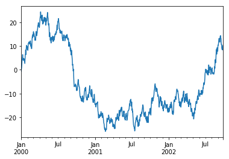
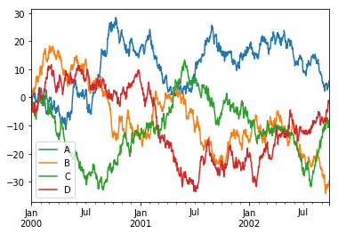

```python
%matplotlib inline
```

### 导入
习惯上，我们这样导入pandas:


```python
import numpy as np
import pandas as pd
import matplotlib.pyplot as plt
```

### 创建对象
通过列表可以创建Series，Pandas会自动创建整型索引。


```python
s=pd.Series([1,3,5,np.nan,6,8])
print(s)
```

    0    1.0
    1    3.0
    2    5.0
    3    NaN
    4    6.0
    5    8.0
    dtype: float64
    

通过NumPy的数组可以创建一个DataFrame。


```python
dates=pd.date_range('20130101',periods=6)
print(dates)
df=pd.DataFrame(np.random.randn(6,4),index=dates,columns=list('ABCD'))
print(df)
```

    DatetimeIndex(['2013-01-01', '2013-01-02', '2013-01-03', '2013-01-04',
                   '2013-01-05', '2013-01-06'],
                  dtype='datetime64[ns]', freq='D')
                       A         B         C         D
    2013-01-01  0.519627  1.751828 -1.349693  1.876903
    2013-01-02 -0.883766  0.926912  0.297259 -0.797213
    2013-01-03 -0.909585  0.503203 -0.184375 -0.946056
    2013-01-04 -0.129277 -2.050695 -0.457264  0.834746
    2013-01-05  0.265509  1.403383 -0.611878 -0.132460
    2013-01-06  1.090137  0.344091  0.075852  0.786603
    

也可以通过字典来创建DataFrame


```python
df2=pd.DataFrame({'A':1.,
                 'B':pd.Timestamp('20130102'),
                 'C':pd.Series(1,index=list(range(4)),dtype='float32'),
                 'D':np.array([3]*4,dtype='int32'),
                 'E':pd.Categorical(['test','train','test','train']),
                 'F':'foo'})
df2
```


<div>
<style>
    .dataframe thead tr:only-child th {
        text-align: right;
    }

    .dataframe thead th {
        text-align: left;
    }

    .dataframe tbody tr th {
        vertical-align: top;
    }
</style>
<table border="1" class="dataframe">
  <thead>
    <tr style="text-align: right;">
      <th></th>
      <th>A</th>
      <th>B</th>
      <th>C</th>
      <th>D</th>
      <th>E</th>
      <th>F</th>
    </tr>
  </thead>
  <tbody>
    <tr>
      <th>0</th>
      <td>1.0</td>
      <td>2013-01-02</td>
      <td>1.0</td>
      <td>3</td>
      <td>test</td>
      <td>foo</td>
    </tr>
    <tr>
      <th>1</th>
      <td>1.0</td>
      <td>2013-01-02</td>
      <td>1.0</td>
      <td>3</td>
      <td>train</td>
      <td>foo</td>
    </tr>
    <tr>
      <th>2</th>
      <td>1.0</td>
      <td>2013-01-02</td>
      <td>1.0</td>
      <td>3</td>
      <td>test</td>
      <td>foo</td>
    </tr>
    <tr>
      <th>3</th>
      <td>1.0</td>
      <td>2013-01-02</td>
      <td>1.0</td>
      <td>3</td>
      <td>train</td>
      <td>foo</td>
    </tr>
  </tbody>
</table>
</div>


设置了特定的dtypes


```python
df2.dtypes
```


    A           float64
    B    datetime64[ns]
    C           float32
    D             int32
    E          category
    F            object
    dtype: object


### 查看数据
查看数据的顶部和底部


```python
print(df.head())
print(df.tail(3))
```

                       A         B         C         D
    2013-01-01  0.519627  1.751828 -1.349693  1.876903
    2013-01-02 -0.883766  0.926912  0.297259 -0.797213
    2013-01-03 -0.909585  0.503203 -0.184375 -0.946056
    2013-01-04 -0.129277 -2.050695 -0.457264  0.834746
    2013-01-05  0.265509  1.403383 -0.611878 -0.132460
                       A         B         C         D
    2013-01-04 -0.129277 -2.050695 -0.457264  0.834746
    2013-01-05  0.265509  1.403383 -0.611878 -0.132460
    2013-01-06  1.090137  0.344091  0.075852  0.786603
    

查看索引，列名，以及纯的NumPy数据


```python
print(df.index)
print(df.columns)
print(df.values)
```

    DatetimeIndex(['2013-01-01', '2013-01-02', '2013-01-03', '2013-01-04',
                   '2013-01-05', '2013-01-06'],
                  dtype='datetime64[ns]', freq='D')
    Index(['A', 'B', 'C', 'D'], dtype='object')
    [[ 0.51962678  1.75182761 -1.34969307  1.87690338]
     [-0.88376601  0.92691199  0.29725942 -0.79721328]
     [-0.90958483  0.50320274 -0.18437465 -0.94605639]
     [-0.12927729 -2.05069512 -0.45726419  0.83474617]
     [ 0.26550921  1.40338325 -0.61187759 -0.13246034]
     [ 1.09013702  0.34409076  0.07585188  0.78660273]]
    

```DataFrame.describe()```提供了便捷的数据统计


```python
df.describe()
```


<div>
<style>
    .dataframe thead tr:only-child th {
        text-align: right;
    }

    .dataframe thead th {
        text-align: left;
    }

    .dataframe tbody tr th {
        vertical-align: top;
    }
</style>
<table border="1" class="dataframe">
  <thead>
    <tr style="text-align: right;">
      <th></th>
      <th>A</th>
      <th>B</th>
      <th>C</th>
      <th>D</th>
    </tr>
  </thead>
  <tbody>
    <tr>
      <th>count</th>
      <td>6.000000</td>
      <td>6.000000</td>
      <td>6.000000</td>
      <td>6.000000</td>
    </tr>
    <tr>
      <th>mean</th>
      <td>-0.007893</td>
      <td>0.479787</td>
      <td>-0.371683</td>
      <td>0.270420</td>
    </tr>
    <tr>
      <th>std</th>
      <td>0.794183</td>
      <td>1.348580</td>
      <td>0.583845</td>
      <td>1.090657</td>
    </tr>
    <tr>
      <th>min</th>
      <td>-0.909585</td>
      <td>-2.050695</td>
      <td>-1.349693</td>
      <td>-0.946056</td>
    </tr>
    <tr>
      <th>25%</th>
      <td>-0.695144</td>
      <td>0.383869</td>
      <td>-0.573224</td>
      <td>-0.631025</td>
    </tr>
    <tr>
      <th>50%</th>
      <td>0.068116</td>
      <td>0.715057</td>
      <td>-0.320819</td>
      <td>0.327071</td>
    </tr>
    <tr>
      <th>75%</th>
      <td>0.456097</td>
      <td>1.284265</td>
      <td>0.010795</td>
      <td>0.822710</td>
    </tr>
    <tr>
      <th>max</th>
      <td>1.090137</td>
      <td>1.751828</td>
      <td>0.297259</td>
      <td>1.876903</td>
    </tr>
  </tbody>
</table>
</div>


转置矩阵


```python
df.T
```


<div>
<style>
    .dataframe thead tr:only-child th {
        text-align: right;
    }

    .dataframe thead th {
        text-align: left;
    }

    .dataframe tbody tr th {
        vertical-align: top;
    }
</style>
<table border="1" class="dataframe">
  <thead>
    <tr style="text-align: right;">
      <th></th>
      <th>2013-01-01 00:00:00</th>
      <th>2013-01-02 00:00:00</th>
      <th>2013-01-03 00:00:00</th>
      <th>2013-01-04 00:00:00</th>
      <th>2013-01-05 00:00:00</th>
      <th>2013-01-06 00:00:00</th>
    </tr>
  </thead>
  <tbody>
    <tr>
      <th>A</th>
      <td>0.519627</td>
      <td>-0.883766</td>
      <td>-0.909585</td>
      <td>-0.129277</td>
      <td>0.265509</td>
      <td>1.090137</td>
    </tr>
    <tr>
      <th>B</th>
      <td>1.751828</td>
      <td>0.926912</td>
      <td>0.503203</td>
      <td>-2.050695</td>
      <td>1.403383</td>
      <td>0.344091</td>
    </tr>
    <tr>
      <th>C</th>
      <td>-1.349693</td>
      <td>0.297259</td>
      <td>-0.184375</td>
      <td>-0.457264</td>
      <td>-0.611878</td>
      <td>0.075852</td>
    </tr>
    <tr>
      <th>D</th>
      <td>1.876903</td>
      <td>-0.797213</td>
      <td>-0.946056</td>
      <td>0.834746</td>
      <td>-0.132460</td>
      <td>0.786603</td>
    </tr>
  </tbody>
</table>
</div>


沿某一轴排序


```python
df.sort_index(axis=1,ascending=False)
```


<div>
<style>
    .dataframe thead tr:only-child th {
        text-align: right;
    }

    .dataframe thead th {
        text-align: left;
    }

    .dataframe tbody tr th {
        vertical-align: top;
    }
</style>
<table border="1" class="dataframe">
  <thead>
    <tr style="text-align: right;">
      <th></th>
      <th>D</th>
      <th>C</th>
      <th>B</th>
      <th>A</th>
    </tr>
  </thead>
  <tbody>
    <tr>
      <th>2013-01-01</th>
      <td>1.876903</td>
      <td>-1.349693</td>
      <td>1.751828</td>
      <td>0.519627</td>
    </tr>
    <tr>
      <th>2013-01-02</th>
      <td>-0.797213</td>
      <td>0.297259</td>
      <td>0.926912</td>
      <td>-0.883766</td>
    </tr>
    <tr>
      <th>2013-01-03</th>
      <td>-0.946056</td>
      <td>-0.184375</td>
      <td>0.503203</td>
      <td>-0.909585</td>
    </tr>
    <tr>
      <th>2013-01-04</th>
      <td>0.834746</td>
      <td>-0.457264</td>
      <td>-2.050695</td>
      <td>-0.129277</td>
    </tr>
    <tr>
      <th>2013-01-05</th>
      <td>-0.132460</td>
      <td>-0.611878</td>
      <td>1.403383</td>
      <td>0.265509</td>
    </tr>
    <tr>
      <th>2013-01-06</th>
      <td>0.786603</td>
      <td>0.075852</td>
      <td>0.344091</td>
      <td>1.090137</td>
    </tr>
  </tbody>
</table>
</div>


按照值进行排序


```python
df.sort_values(by='B')
```


<div>
<style>
    .dataframe thead tr:only-child th {
        text-align: right;
    }

    .dataframe thead th {
        text-align: left;
    }

    .dataframe tbody tr th {
        vertical-align: top;
    }
</style>
<table border="1" class="dataframe">
  <thead>
    <tr style="text-align: right;">
      <th></th>
      <th>A</th>
      <th>B</th>
      <th>C</th>
      <th>D</th>
    </tr>
  </thead>
  <tbody>
    <tr>
      <th>2013-01-04</th>
      <td>-0.129277</td>
      <td>-2.050695</td>
      <td>-0.457264</td>
      <td>0.834746</td>
    </tr>
    <tr>
      <th>2013-01-06</th>
      <td>1.090137</td>
      <td>0.344091</td>
      <td>0.075852</td>
      <td>0.786603</td>
    </tr>
    <tr>
      <th>2013-01-03</th>
      <td>-0.909585</td>
      <td>0.503203</td>
      <td>-0.184375</td>
      <td>-0.946056</td>
    </tr>
    <tr>
      <th>2013-01-02</th>
      <td>-0.883766</td>
      <td>0.926912</td>
      <td>0.297259</td>
      <td>-0.797213</td>
    </tr>
    <tr>
      <th>2013-01-05</th>
      <td>0.265509</td>
      <td>1.403383</td>
      <td>-0.611878</td>
      <td>-0.132460</td>
    </tr>
    <tr>
      <th>2013-01-01</th>
      <td>0.519627</td>
      <td>1.751828</td>
      <td>-1.349693</td>
      <td>1.876903</td>
    </tr>
  </tbody>
</table>
</div>


### 数据选择
**注意：**尽管Python标准库和NumPy的语句在选择和设置数据时更直观和方便交互。但是在生产环境中，我们更建议使用Pandas的数据访问函数：```.at, .iat, .loc, .iloc, .ix```

#### 数据获取
选择一列，返回Series。等同于df.A


```python
df['A']
```


    2013-01-01    0.519627
    2013-01-02   -0.883766
    2013-01-03   -0.909585
    2013-01-04   -0.129277
    2013-01-05    0.265509
    2013-01-06    1.090137
    Freq: D, Name: A, dtype: float64


使用```[]```来切分多行数据


```python
print(df[0:3])
print(df['20130102':'20130104'])
```

                       A         B         C         D
    2013-01-01  0.519627  1.751828 -1.349693  1.876903
    2013-01-02 -0.883766  0.926912  0.297259 -0.797213
    2013-01-03 -0.909585  0.503203 -0.184375 -0.946056
                       A         B         C         D
    2013-01-02 -0.883766  0.926912  0.297259 -0.797213
    2013-01-03 -0.909585  0.503203 -0.184375 -0.946056
    2013-01-04 -0.129277 -2.050695 -0.457264  0.834746
    

#### 根据标签选择
使用标签来得到特定的一行


```python
df.loc[dates[0]]
```


    A    0.519627
    B    1.751828
    C   -1.349693
    D    1.876903
    Name: 2013-01-01 00:00:00, dtype: float64


使用标签来得到多个指定的列


```python
df.loc[:,['A','B']]
```


<div>
<style>
    .dataframe thead tr:only-child th {
        text-align: right;
    }

    .dataframe thead th {
        text-align: left;
    }

    .dataframe tbody tr th {
        vertical-align: top;
    }
</style>
<table border="1" class="dataframe">
  <thead>
    <tr style="text-align: right;">
      <th></th>
      <th>A</th>
      <th>B</th>
    </tr>
  </thead>
  <tbody>
    <tr>
      <th>2013-01-01</th>
      <td>0.519627</td>
      <td>1.751828</td>
    </tr>
    <tr>
      <th>2013-01-02</th>
      <td>-0.883766</td>
      <td>0.926912</td>
    </tr>
    <tr>
      <th>2013-01-03</th>
      <td>-0.909585</td>
      <td>0.503203</td>
    </tr>
    <tr>
      <th>2013-01-04</th>
      <td>-0.129277</td>
      <td>-2.050695</td>
    </tr>
    <tr>
      <th>2013-01-05</th>
      <td>0.265509</td>
      <td>1.403383</td>
    </tr>
    <tr>
      <th>2013-01-06</th>
      <td>1.090137</td>
      <td>0.344091</td>
    </tr>
  </tbody>
</table>
</div>


用标签来切片时，端点的值都是被包含在内的


```python
df.loc['20130102':'20130104',['A','B']]
```


<div>
<style>
    .dataframe thead tr:only-child th {
        text-align: right;
    }

    .dataframe thead th {
        text-align: left;
    }

    .dataframe tbody tr th {
        vertical-align: top;
    }
</style>
<table border="1" class="dataframe">
  <thead>
    <tr style="text-align: right;">
      <th></th>
      <th>A</th>
      <th>B</th>
    </tr>
  </thead>
  <tbody>
    <tr>
      <th>2013-01-02</th>
      <td>-0.883766</td>
      <td>0.926912</td>
    </tr>
    <tr>
      <th>2013-01-03</th>
      <td>-0.909585</td>
      <td>0.503203</td>
    </tr>
    <tr>
      <th>2013-01-04</th>
      <td>-0.129277</td>
      <td>-2.050695</td>
    </tr>
  </tbody>
</table>
</div>


选择的返回值可以降低维度


```python
df.loc['20130102',['A','B']]
```


    A   -0.883766
    B    0.926912
    Name: 2013-01-02 00:00:00, dtype: float64


选择一个标量


```python
df.loc[dates[0],'A']
```


    0.51962677829927584


快速获取一个标量（与上面相同）


```python
df.at[dates[0],'A']
```


    0.51962677829927584


#### 根据位置进行选择
根据整数下标来选择数据


```python
df.iloc[3]
```


    A   -0.129277
    B   -2.050695
    C   -0.457264
    D    0.834746
    Name: 2013-01-04 00:00:00, dtype: float64


用整数来切片，类似于Python标准库和NumPy


```python
df.iloc[3:5,0:2]
```


<div>
<style>
    .dataframe thead tr:only-child th {
        text-align: right;
    }

    .dataframe thead th {
        text-align: left;
    }

    .dataframe tbody tr th {
        vertical-align: top;
    }
</style>
<table border="1" class="dataframe">
  <thead>
    <tr style="text-align: right;">
      <th></th>
      <th>A</th>
      <th>B</th>
    </tr>
  </thead>
  <tbody>
    <tr>
      <th>2013-01-04</th>
      <td>-0.129277</td>
      <td>-2.050695</td>
    </tr>
    <tr>
      <th>2013-01-05</th>
      <td>0.265509</td>
      <td>1.403383</td>
    </tr>
  </tbody>
</table>
</div>


用整数列表来进行选择，与Python标准库和NumPy类似


```python
df.iloc[[1,2,4],[0,2]]
```


<div>
<style>
    .dataframe thead tr:only-child th {
        text-align: right;
    }

    .dataframe thead th {
        text-align: left;
    }

    .dataframe tbody tr th {
        vertical-align: top;
    }
</style>
<table border="1" class="dataframe">
  <thead>
    <tr style="text-align: right;">
      <th></th>
      <th>A</th>
      <th>C</th>
    </tr>
  </thead>
  <tbody>
    <tr>
      <th>2013-01-02</th>
      <td>-0.883766</td>
      <td>0.297259</td>
    </tr>
    <tr>
      <th>2013-01-03</th>
      <td>-0.909585</td>
      <td>-0.184375</td>
    </tr>
    <tr>
      <th>2013-01-05</th>
      <td>0.265509</td>
      <td>-0.611878</td>
    </tr>
  </tbody>
</table>
</div>


对行进行切片选择


```python
df.iloc[1:3,:]
```


<div>
<style>
    .dataframe thead tr:only-child th {
        text-align: right;
    }

    .dataframe thead th {
        text-align: left;
    }

    .dataframe tbody tr th {
        vertical-align: top;
    }
</style>
<table border="1" class="dataframe">
  <thead>
    <tr style="text-align: right;">
      <th></th>
      <th>A</th>
      <th>B</th>
      <th>C</th>
      <th>D</th>
    </tr>
  </thead>
  <tbody>
    <tr>
      <th>2013-01-02</th>
      <td>-0.883766</td>
      <td>0.926912</td>
      <td>0.297259</td>
      <td>-0.797213</td>
    </tr>
    <tr>
      <th>2013-01-03</th>
      <td>-0.909585</td>
      <td>0.503203</td>
      <td>-0.184375</td>
      <td>-0.946056</td>
    </tr>
  </tbody>
</table>
</div>


对列进行切片选择


```python
df.iloc[:,1:3]
```


<div>
<style>
    .dataframe thead tr:only-child th {
        text-align: right;
    }

    .dataframe thead th {
        text-align: left;
    }

    .dataframe tbody tr th {
        vertical-align: top;
    }
</style>
<table border="1" class="dataframe">
  <thead>
    <tr style="text-align: right;">
      <th></th>
      <th>B</th>
      <th>C</th>
    </tr>
  </thead>
  <tbody>
    <tr>
      <th>2013-01-01</th>
      <td>1.751828</td>
      <td>-1.349693</td>
    </tr>
    <tr>
      <th>2013-01-02</th>
      <td>0.926912</td>
      <td>0.297259</td>
    </tr>
    <tr>
      <th>2013-01-03</th>
      <td>0.503203</td>
      <td>-0.184375</td>
    </tr>
    <tr>
      <th>2013-01-04</th>
      <td>-2.050695</td>
      <td>-0.457264</td>
    </tr>
    <tr>
      <th>2013-01-05</th>
      <td>1.403383</td>
      <td>-0.611878</td>
    </tr>
    <tr>
      <th>2013-01-06</th>
      <td>0.344091</td>
      <td>0.075852</td>
    </tr>
  </tbody>
</table>
</div>


获取某个标量


```python
df.iloc[1,1]
```


    0.92691199315835471


快速地获取某个标量（与上面的函数相同）


```python
df.iat[1,1]
```


    0.92691199315835471


#### 布尔索引
使用某列值来选择数据


```python
df[df.A>0]
```


<div>
<style>
    .dataframe thead tr:only-child th {
        text-align: right;
    }

    .dataframe thead th {
        text-align: left;
    }

    .dataframe tbody tr th {
        vertical-align: top;
    }
</style>
<table border="1" class="dataframe">
  <thead>
    <tr style="text-align: right;">
      <th></th>
      <th>A</th>
      <th>B</th>
      <th>C</th>
      <th>D</th>
    </tr>
  </thead>
  <tbody>
    <tr>
      <th>2013-01-01</th>
      <td>0.519627</td>
      <td>1.751828</td>
      <td>-1.349693</td>
      <td>1.876903</td>
    </tr>
    <tr>
      <th>2013-01-05</th>
      <td>0.265509</td>
      <td>1.403383</td>
      <td>-0.611878</td>
      <td>-0.132460</td>
    </tr>
    <tr>
      <th>2013-01-06</th>
      <td>1.090137</td>
      <td>0.344091</td>
      <td>0.075852</td>
      <td>0.786603</td>
    </tr>
  </tbody>
</table>
</div>


从DataFrame中选择满足某条件的数据


```python
df[df>0]
```


<div>
<style>
    .dataframe thead tr:only-child th {
        text-align: right;
    }

    .dataframe thead th {
        text-align: left;
    }

    .dataframe tbody tr th {
        vertical-align: top;
    }
</style>
<table border="1" class="dataframe">
  <thead>
    <tr style="text-align: right;">
      <th></th>
      <th>A</th>
      <th>B</th>
      <th>C</th>
      <th>D</th>
    </tr>
  </thead>
  <tbody>
    <tr>
      <th>2013-01-01</th>
      <td>0.519627</td>
      <td>1.751828</td>
      <td>NaN</td>
      <td>1.876903</td>
    </tr>
    <tr>
      <th>2013-01-02</th>
      <td>NaN</td>
      <td>0.926912</td>
      <td>0.297259</td>
      <td>NaN</td>
    </tr>
    <tr>
      <th>2013-01-03</th>
      <td>NaN</td>
      <td>0.503203</td>
      <td>NaN</td>
      <td>NaN</td>
    </tr>
    <tr>
      <th>2013-01-04</th>
      <td>NaN</td>
      <td>NaN</td>
      <td>NaN</td>
      <td>0.834746</td>
    </tr>
    <tr>
      <th>2013-01-05</th>
      <td>0.265509</td>
      <td>1.403383</td>
      <td>NaN</td>
      <td>NaN</td>
    </tr>
    <tr>
      <th>2013-01-06</th>
      <td>1.090137</td>
      <td>0.344091</td>
      <td>0.075852</td>
      <td>0.786603</td>
    </tr>
  </tbody>
</table>
</div>


使用```isin()```函数来过滤数据


```python
df2=df.copy()
df2['E']=['one','one','two','three','four','three']
print(df2)
df2[df2['E'].isin(['two','four'])]
```

                       A         B         C         D      E
    2013-01-01  0.519627  1.751828 -1.349693  1.876903    one
    2013-01-02 -0.883766  0.926912  0.297259 -0.797213    one
    2013-01-03 -0.909585  0.503203 -0.184375 -0.946056    two
    2013-01-04 -0.129277 -2.050695 -0.457264  0.834746  three
    2013-01-05  0.265509  1.403383 -0.611878 -0.132460   four
    2013-01-06  1.090137  0.344091  0.075852  0.786603  three
    


<div>
<style>
    .dataframe thead tr:only-child th {
        text-align: right;
    }

    .dataframe thead th {
        text-align: left;
    }

    .dataframe tbody tr th {
        vertical-align: top;
    }
</style>
<table border="1" class="dataframe">
  <thead>
    <tr style="text-align: right;">
      <th></th>
      <th>A</th>
      <th>B</th>
      <th>C</th>
      <th>D</th>
      <th>E</th>
    </tr>
  </thead>
  <tbody>
    <tr>
      <th>2013-01-03</th>
      <td>-0.909585</td>
      <td>0.503203</td>
      <td>-0.184375</td>
      <td>-0.946056</td>
      <td>two</td>
    </tr>
    <tr>
      <th>2013-01-05</th>
      <td>0.265509</td>
      <td>1.403383</td>
      <td>-0.611878</td>
      <td>-0.132460</td>
      <td>four</td>
    </tr>
  </tbody>
</table>
</div>


#### 设置数据
设置一个新列并设置索引


```python
s1=pd.Series([1,2,3,4,5,6],index=pd.date_range('20130102',periods=6))
df['F']=s1
s1
```


    2013-01-02    1
    2013-01-03    2
    2013-01-04    3
    2013-01-05    4
    2013-01-06    5
    2013-01-07    6
    Freq: D, dtype: int64


根据标签来设置值


```python
df.at[dates[0],'A']=0
df
```


<div>
<style>
    .dataframe thead tr:only-child th {
        text-align: right;
    }

    .dataframe thead th {
        text-align: left;
    }

    .dataframe tbody tr th {
        vertical-align: top;
    }
</style>
<table border="1" class="dataframe">
  <thead>
    <tr style="text-align: right;">
      <th></th>
      <th>A</th>
      <th>B</th>
      <th>C</th>
      <th>D</th>
      <th>F</th>
    </tr>
  </thead>
  <tbody>
    <tr>
      <th>2013-01-01</th>
      <td>0.000000</td>
      <td>1.751828</td>
      <td>-1.349693</td>
      <td>1.876903</td>
      <td>NaN</td>
    </tr>
    <tr>
      <th>2013-01-02</th>
      <td>-0.883766</td>
      <td>0.926912</td>
      <td>0.297259</td>
      <td>-0.797213</td>
      <td>1.0</td>
    </tr>
    <tr>
      <th>2013-01-03</th>
      <td>-0.909585</td>
      <td>0.503203</td>
      <td>-0.184375</td>
      <td>-0.946056</td>
      <td>2.0</td>
    </tr>
    <tr>
      <th>2013-01-04</th>
      <td>-0.129277</td>
      <td>-2.050695</td>
      <td>-0.457264</td>
      <td>0.834746</td>
      <td>3.0</td>
    </tr>
    <tr>
      <th>2013-01-05</th>
      <td>0.265509</td>
      <td>1.403383</td>
      <td>-0.611878</td>
      <td>-0.132460</td>
      <td>4.0</td>
    </tr>
    <tr>
      <th>2013-01-06</th>
      <td>1.090137</td>
      <td>0.344091</td>
      <td>0.075852</td>
      <td>0.786603</td>
      <td>5.0</td>
    </tr>
  </tbody>
</table>
</div>


根据位置的来设置值


```python
df.iat[0,1]=0
df
```


<div>
<style>
    .dataframe thead tr:only-child th {
        text-align: right;
    }

    .dataframe thead th {
        text-align: left;
    }

    .dataframe tbody tr th {
        vertical-align: top;
    }
</style>
<table border="1" class="dataframe">
  <thead>
    <tr style="text-align: right;">
      <th></th>
      <th>A</th>
      <th>B</th>
      <th>C</th>
      <th>D</th>
      <th>F</th>
    </tr>
  </thead>
  <tbody>
    <tr>
      <th>2013-01-01</th>
      <td>0.000000</td>
      <td>0.000000</td>
      <td>-1.349693</td>
      <td>1.876903</td>
      <td>NaN</td>
    </tr>
    <tr>
      <th>2013-01-02</th>
      <td>-0.883766</td>
      <td>0.926912</td>
      <td>0.297259</td>
      <td>-0.797213</td>
      <td>1.0</td>
    </tr>
    <tr>
      <th>2013-01-03</th>
      <td>-0.909585</td>
      <td>0.503203</td>
      <td>-0.184375</td>
      <td>-0.946056</td>
      <td>2.0</td>
    </tr>
    <tr>
      <th>2013-01-04</th>
      <td>-0.129277</td>
      <td>-2.050695</td>
      <td>-0.457264</td>
      <td>0.834746</td>
      <td>3.0</td>
    </tr>
    <tr>
      <th>2013-01-05</th>
      <td>0.265509</td>
      <td>1.403383</td>
      <td>-0.611878</td>
      <td>-0.132460</td>
      <td>4.0</td>
    </tr>
    <tr>
      <th>2013-01-06</th>
      <td>1.090137</td>
      <td>0.344091</td>
      <td>0.075852</td>
      <td>0.786603</td>
      <td>5.0</td>
    </tr>
  </tbody>
</table>
</div>


使用NumPy数组来赋值


```python
df.loc[:,'D']=np.array([5]*len(df))
df
```


<div>
<style>
    .dataframe thead tr:only-child th {
        text-align: right;
    }

    .dataframe thead th {
        text-align: left;
    }

    .dataframe tbody tr th {
        vertical-align: top;
    }
</style>
<table border="1" class="dataframe">
  <thead>
    <tr style="text-align: right;">
      <th></th>
      <th>A</th>
      <th>B</th>
      <th>C</th>
      <th>D</th>
      <th>F</th>
    </tr>
  </thead>
  <tbody>
    <tr>
      <th>2013-01-01</th>
      <td>0.000000</td>
      <td>0.000000</td>
      <td>-1.349693</td>
      <td>5</td>
      <td>NaN</td>
    </tr>
    <tr>
      <th>2013-01-02</th>
      <td>-0.883766</td>
      <td>0.926912</td>
      <td>0.297259</td>
      <td>5</td>
      <td>1.0</td>
    </tr>
    <tr>
      <th>2013-01-03</th>
      <td>-0.909585</td>
      <td>0.503203</td>
      <td>-0.184375</td>
      <td>5</td>
      <td>2.0</td>
    </tr>
    <tr>
      <th>2013-01-04</th>
      <td>-0.129277</td>
      <td>-2.050695</td>
      <td>-0.457264</td>
      <td>5</td>
      <td>3.0</td>
    </tr>
    <tr>
      <th>2013-01-05</th>
      <td>0.265509</td>
      <td>1.403383</td>
      <td>-0.611878</td>
      <td>5</td>
      <td>4.0</td>
    </tr>
    <tr>
      <th>2013-01-06</th>
      <td>1.090137</td>
      <td>0.344091</td>
      <td>0.075852</td>
      <td>5</td>
      <td>5.0</td>
    </tr>
  </tbody>
</table>
</div>


在过滤的同时进行赋值


```python
df2=df.copy()
df2[df2>0]=-df2
df2
```


<div>
<style>
    .dataframe thead tr:only-child th {
        text-align: right;
    }

    .dataframe thead th {
        text-align: left;
    }

    .dataframe tbody tr th {
        vertical-align: top;
    }
</style>
<table border="1" class="dataframe">
  <thead>
    <tr style="text-align: right;">
      <th></th>
      <th>A</th>
      <th>B</th>
      <th>C</th>
      <th>D</th>
      <th>F</th>
    </tr>
  </thead>
  <tbody>
    <tr>
      <th>2013-01-01</th>
      <td>0.000000</td>
      <td>0.000000</td>
      <td>-1.349693</td>
      <td>-5</td>
      <td>NaN</td>
    </tr>
    <tr>
      <th>2013-01-02</th>
      <td>-0.883766</td>
      <td>-0.926912</td>
      <td>-0.297259</td>
      <td>-5</td>
      <td>-1.0</td>
    </tr>
    <tr>
      <th>2013-01-03</th>
      <td>-0.909585</td>
      <td>-0.503203</td>
      <td>-0.184375</td>
      <td>-5</td>
      <td>-2.0</td>
    </tr>
    <tr>
      <th>2013-01-04</th>
      <td>-0.129277</td>
      <td>-2.050695</td>
      <td>-0.457264</td>
      <td>-5</td>
      <td>-3.0</td>
    </tr>
    <tr>
      <th>2013-01-05</th>
      <td>-0.265509</td>
      <td>-1.403383</td>
      <td>-0.611878</td>
      <td>-5</td>
      <td>-4.0</td>
    </tr>
    <tr>
      <th>2013-01-06</th>
      <td>-1.090137</td>
      <td>-0.344091</td>
      <td>-0.075852</td>
      <td>-5</td>
      <td>-5.0</td>
    </tr>
  </tbody>
</table>
</div>


### 处理缺失数据
Pandas主要使用```np.nan```来表示缺失数据。这个值不会加入在计算中。
重新索引允许你对某一轴的索引进行更改/添加/删除操作。这会返回操作数据的拷贝对象。


```python
df1=df.reindex(index=dates[0:4],columns=list(df.columns)+['E'])
df1.loc[dates[0]:dates[1],'E']=1
df1
```


<div>
<style>
    .dataframe thead tr:only-child th {
        text-align: right;
    }

    .dataframe thead th {
        text-align: left;
    }

    .dataframe tbody tr th {
        vertical-align: top;
    }
</style>
<table border="1" class="dataframe">
  <thead>
    <tr style="text-align: right;">
      <th></th>
      <th>A</th>
      <th>B</th>
      <th>C</th>
      <th>D</th>
      <th>F</th>
      <th>E</th>
    </tr>
  </thead>
  <tbody>
    <tr>
      <th>2013-01-01</th>
      <td>0.000000</td>
      <td>0.000000</td>
      <td>-1.349693</td>
      <td>5</td>
      <td>NaN</td>
      <td>1.0</td>
    </tr>
    <tr>
      <th>2013-01-02</th>
      <td>-0.883766</td>
      <td>0.926912</td>
      <td>0.297259</td>
      <td>5</td>
      <td>1.0</td>
      <td>1.0</td>
    </tr>
    <tr>
      <th>2013-01-03</th>
      <td>-0.909585</td>
      <td>0.503203</td>
      <td>-0.184375</td>
      <td>5</td>
      <td>2.0</td>
      <td>NaN</td>
    </tr>
    <tr>
      <th>2013-01-04</th>
      <td>-0.129277</td>
      <td>-2.050695</td>
      <td>-0.457264</td>
      <td>5</td>
      <td>3.0</td>
      <td>NaN</td>
    </tr>
  </tbody>
</table>
</div>


删除含有缺失数据的行


```python
df1.dropna(how='any')
```


<div>
<style>
    .dataframe thead tr:only-child th {
        text-align: right;
    }

    .dataframe thead th {
        text-align: left;
    }

    .dataframe tbody tr th {
        vertical-align: top;
    }
</style>
<table border="1" class="dataframe">
  <thead>
    <tr style="text-align: right;">
      <th></th>
      <th>A</th>
      <th>B</th>
      <th>C</th>
      <th>D</th>
      <th>F</th>
      <th>E</th>
    </tr>
  </thead>
  <tbody>
    <tr>
      <th>2013-01-02</th>
      <td>-0.883766</td>
      <td>0.926912</td>
      <td>0.297259</td>
      <td>5</td>
      <td>1.0</td>
      <td>1.0</td>
    </tr>
  </tbody>
</table>
</div>


填充缺失数据


```python
df1.fillna(value=5)
```


<div>
<style>
    .dataframe thead tr:only-child th {
        text-align: right;
    }

    .dataframe thead th {
        text-align: left;
    }

    .dataframe tbody tr th {
        vertical-align: top;
    }
</style>
<table border="1" class="dataframe">
  <thead>
    <tr style="text-align: right;">
      <th></th>
      <th>A</th>
      <th>B</th>
      <th>C</th>
      <th>D</th>
      <th>F</th>
      <th>E</th>
    </tr>
  </thead>
  <tbody>
    <tr>
      <th>2013-01-01</th>
      <td>0.000000</td>
      <td>0.000000</td>
      <td>-1.349693</td>
      <td>5</td>
      <td>5.0</td>
      <td>1.0</td>
    </tr>
    <tr>
      <th>2013-01-02</th>
      <td>-0.883766</td>
      <td>0.926912</td>
      <td>0.297259</td>
      <td>5</td>
      <td>1.0</td>
      <td>1.0</td>
    </tr>
    <tr>
      <th>2013-01-03</th>
      <td>-0.909585</td>
      <td>0.503203</td>
      <td>-0.184375</td>
      <td>5</td>
      <td>2.0</td>
      <td>5.0</td>
    </tr>
    <tr>
      <th>2013-01-04</th>
      <td>-0.129277</td>
      <td>-2.050695</td>
      <td>-0.457264</td>
      <td>5</td>
      <td>3.0</td>
      <td>5.0</td>
    </tr>
  </tbody>
</table>
</div>


获取数据中是```nan```的位置


```python
pd.isnull(df1)
```


<div>
<style>
    .dataframe thead tr:only-child th {
        text-align: right;
    }

    .dataframe thead th {
        text-align: left;
    }

    .dataframe tbody tr th {
        vertical-align: top;
    }
</style>
<table border="1" class="dataframe">
  <thead>
    <tr style="text-align: right;">
      <th></th>
      <th>A</th>
      <th>B</th>
      <th>C</th>
      <th>D</th>
      <th>F</th>
      <th>E</th>
    </tr>
  </thead>
  <tbody>
    <tr>
      <th>2013-01-01</th>
      <td>False</td>
      <td>False</td>
      <td>False</td>
      <td>False</td>
      <td>True</td>
      <td>False</td>
    </tr>
    <tr>
      <th>2013-01-02</th>
      <td>False</td>
      <td>False</td>
      <td>False</td>
      <td>False</td>
      <td>False</td>
      <td>False</td>
    </tr>
    <tr>
      <th>2013-01-03</th>
      <td>False</td>
      <td>False</td>
      <td>False</td>
      <td>False</td>
      <td>False</td>
      <td>True</td>
    </tr>
    <tr>
      <th>2013-01-04</th>
      <td>False</td>
      <td>False</td>
      <td>False</td>
      <td>False</td>
      <td>False</td>
      <td>True</td>
    </tr>
  </tbody>
</table>
</div>


### 基础操作
#### 基本的统计
操作默认排除了缺失的数据  
执行一个描述性的统计


```python
df.mean()
```


    A   -0.094497
    B    0.187816
    C   -0.371683
    D    5.000000
    F    3.000000
    dtype: float64


在另外的轴执行该操作


```python
df.mean(1)
```


    2013-01-01    0.912577
    2013-01-02    1.268081
    2013-01-03    1.281849
    2013-01-04    1.072553
    2013-01-05    2.011403
    2013-01-06    2.302016
    Freq: D, dtype: float64


对不同维度数据的操作需要进行校准。Pandas会自动的在指定的维数上应用广播。


```python
s=pd.Series([1,3,5,np.nan,6,8],index=dates).shift(2)
print(s)
df.sub(s,axis='index')
```

    2013-01-01    NaN
    2013-01-02    NaN
    2013-01-03    1.0
    2013-01-04    3.0
    2013-01-05    5.0
    2013-01-06    NaN
    Freq: D, dtype: float64
    


<div>
<style>
    .dataframe thead tr:only-child th {
        text-align: right;
    }

    .dataframe thead th {
        text-align: left;
    }

    .dataframe tbody tr th {
        vertical-align: top;
    }
</style>
<table border="1" class="dataframe">
  <thead>
    <tr style="text-align: right;">
      <th></th>
      <th>A</th>
      <th>B</th>
      <th>C</th>
      <th>D</th>
      <th>F</th>
    </tr>
  </thead>
  <tbody>
    <tr>
      <th>2013-01-01</th>
      <td>NaN</td>
      <td>NaN</td>
      <td>NaN</td>
      <td>NaN</td>
      <td>NaN</td>
    </tr>
    <tr>
      <th>2013-01-02</th>
      <td>NaN</td>
      <td>NaN</td>
      <td>NaN</td>
      <td>NaN</td>
      <td>NaN</td>
    </tr>
    <tr>
      <th>2013-01-03</th>
      <td>-1.909585</td>
      <td>-0.496797</td>
      <td>-1.184375</td>
      <td>4.0</td>
      <td>1.0</td>
    </tr>
    <tr>
      <th>2013-01-04</th>
      <td>-3.129277</td>
      <td>-5.050695</td>
      <td>-3.457264</td>
      <td>2.0</td>
      <td>0.0</td>
    </tr>
    <tr>
      <th>2013-01-05</th>
      <td>-4.734491</td>
      <td>-3.596617</td>
      <td>-5.611878</td>
      <td>0.0</td>
      <td>-1.0</td>
    </tr>
    <tr>
      <th>2013-01-06</th>
      <td>NaN</td>
      <td>NaN</td>
      <td>NaN</td>
      <td>NaN</td>
      <td>NaN</td>
    </tr>
  </tbody>
</table>
</div>


#### 应用函数
对数据应用函数


```python
print(df.apply(np.cumsum))
df.apply(lambda x:x.max()-x.min())
```

                       A         B         C   D     F
    2013-01-01  0.000000  0.000000 -1.349693   5   NaN
    2013-01-02 -0.883766  0.926912 -1.052434  10   1.0
    2013-01-03 -1.793351  1.430115 -1.236808  15   3.0
    2013-01-04 -1.922628 -0.620580 -1.694072  20   6.0
    2013-01-05 -1.657119  0.782803 -2.305950  25  10.0
    2013-01-06 -0.566982  1.126894 -2.230098  30  15.0
    


    A    1.999722
    B    3.454078
    C    1.646952
    D    0.000000
    F    4.000000
    dtype: float64


#### 直方图


```python
s=pd.Series(np.random.randint(0,7,size=10))
print(s)
print(s.value_counts())
```

    0    2
    1    2
    2    4
    3    2
    4    4
    5    2
    6    1
    7    4
    8    1
    9    3
    dtype: int32
    2    4
    4    3
    1    2
    3    1
    dtype: int64
    

#### 字符串函数
在下面的代码中，Series可以在```str```属性中应用许多字符处理函数，可以更方便的处理数据中的每个元素。需要注意的是模式识别默认使用正则表达式。


```python
s=pd.Series(['A','B','C','Aaba','Baca',np.nan,'CABA','dog','cat'])
s.str.lower()
```


    0       a
    1       b
    2       c
    3    aaba
    4    baca
    5     NaN
    6    caba
    7     dog
    8     cat
    dtype: object


### 数据合并
#### 数据拼接
Pandas提供了许多工具来根据索引逻辑和线性代数关系组合Series、DataFrame和Panel。
用```concat()```组合Pandas数据


```python
df=pd.DataFrame(np.random.randn(10,4))
print(df)
pieces=[df[:3],df[3:7],df[7:]]
pd.concat(pieces)
```

              0         1         2         3
    0 -1.185957  0.003406 -0.418602 -1.795964
    1  1.476123  0.740420 -0.309832 -0.030821
    2 -1.130280  1.407282  0.704248 -0.312520
    3 -0.458707  0.406656  1.141934 -0.432106
    4  2.310688  0.019981  2.008694  1.636378
    5 -0.102571  1.274324 -0.336140  2.077588
    6  0.394941 -0.198624  0.627003 -0.141601
    7 -1.157877 -2.396454 -0.309037 -0.290056
    8  0.778280 -1.036365 -1.471681 -0.482089
    9  0.163682  1.242630  0.708397  0.579707
    


<div>
<style>
    .dataframe thead tr:only-child th {
        text-align: right;
    }

    .dataframe thead th {
        text-align: left;
    }

    .dataframe tbody tr th {
        vertical-align: top;
    }
</style>
<table border="1" class="dataframe">
  <thead>
    <tr style="text-align: right;">
      <th></th>
      <th>0</th>
      <th>1</th>
      <th>2</th>
      <th>3</th>
    </tr>
  </thead>
  <tbody>
    <tr>
      <th>0</th>
      <td>-1.185957</td>
      <td>0.003406</td>
      <td>-0.418602</td>
      <td>-1.795964</td>
    </tr>
    <tr>
      <th>1</th>
      <td>1.476123</td>
      <td>0.740420</td>
      <td>-0.309832</td>
      <td>-0.030821</td>
    </tr>
    <tr>
      <th>2</th>
      <td>-1.130280</td>
      <td>1.407282</td>
      <td>0.704248</td>
      <td>-0.312520</td>
    </tr>
    <tr>
      <th>3</th>
      <td>-0.458707</td>
      <td>0.406656</td>
      <td>1.141934</td>
      <td>-0.432106</td>
    </tr>
    <tr>
      <th>4</th>
      <td>2.310688</td>
      <td>0.019981</td>
      <td>2.008694</td>
      <td>1.636378</td>
    </tr>
    <tr>
      <th>5</th>
      <td>-0.102571</td>
      <td>1.274324</td>
      <td>-0.336140</td>
      <td>2.077588</td>
    </tr>
    <tr>
      <th>6</th>
      <td>0.394941</td>
      <td>-0.198624</td>
      <td>0.627003</td>
      <td>-0.141601</td>
    </tr>
    <tr>
      <th>7</th>
      <td>-1.157877</td>
      <td>-2.396454</td>
      <td>-0.309037</td>
      <td>-0.290056</td>
    </tr>
    <tr>
      <th>8</th>
      <td>0.778280</td>
      <td>-1.036365</td>
      <td>-1.471681</td>
      <td>-0.482089</td>
    </tr>
    <tr>
      <th>9</th>
      <td>0.163682</td>
      <td>1.242630</td>
      <td>0.708397</td>
      <td>0.579707</td>
    </tr>
  </tbody>
</table>
</div>


#### 数据关联
SQL形式


```python
left=pd.DataFrame({'key':['foo','foo'],'lval':[1,2]})
right=pd.DataFrame({'key':['foo','foo'],'rval':[4,5]})
print(left)
print(right)
pd.merge(left,right,on='key')
```

       key  lval
    0  foo     1
    1  foo     2
       key  rval
    0  foo     4
    1  foo     5
    


<div>
<style>
    .dataframe thead tr:only-child th {
        text-align: right;
    }

    .dataframe thead th {
        text-align: left;
    }

    .dataframe tbody tr th {
        vertical-align: top;
    }
</style>
<table border="1" class="dataframe">
  <thead>
    <tr style="text-align: right;">
      <th></th>
      <th>key</th>
      <th>lval</th>
      <th>rval</th>
    </tr>
  </thead>
  <tbody>
    <tr>
      <th>0</th>
      <td>foo</td>
      <td>1</td>
      <td>4</td>
    </tr>
    <tr>
      <th>1</th>
      <td>foo</td>
      <td>1</td>
      <td>5</td>
    </tr>
    <tr>
      <th>2</th>
      <td>foo</td>
      <td>2</td>
      <td>4</td>
    </tr>
    <tr>
      <th>3</th>
      <td>foo</td>
      <td>2</td>
      <td>5</td>
    </tr>
  </tbody>
</table>
</div>


```python
left=pd.DataFrame({'key':['foo','bar'],'lval':[1,2]})
right=pd.DataFrame({'key':['foo','bar'],'rval':[4,5]})
print(left)
print(right)
pd.merge(left,right,on='key')
```

       key  lval
    0  foo     1
    1  bar     2
       key  rval
    0  foo     4
    1  bar     5
    


<div>
<style>
    .dataframe thead tr:only-child th {
        text-align: right;
    }

    .dataframe thead th {
        text-align: left;
    }

    .dataframe tbody tr th {
        vertical-align: top;
    }
</style>
<table border="1" class="dataframe">
  <thead>
    <tr style="text-align: right;">
      <th></th>
      <th>key</th>
      <th>lval</th>
      <th>rval</th>
    </tr>
  </thead>
  <tbody>
    <tr>
      <th>0</th>
      <td>foo</td>
      <td>1</td>
      <td>4</td>
    </tr>
    <tr>
      <th>1</th>
      <td>bar</td>
      <td>2</td>
      <td>5</td>
    </tr>
  </tbody>
</table>
</div>


#### 添加数据（Append）
给DataFrame添加行


```python
df=pd.DataFrame(np.random.randn(8,4),columns=['A','B','C','D'])
print(df)
s=df.iloc[3]
df.append(s,ignore_index=True)
```

              A         B         C         D
    0  0.003068 -0.485285 -0.419189  0.153555
    1 -1.068066  0.369219  0.433112  0.430304
    2  0.536439  0.036806 -0.482881 -1.012446
    3  0.712923 -0.249292 -0.193645  1.042048
    4  0.930002  1.783770  1.908079  0.554436
    5  2.453541  0.256729  1.437505 -1.486410
    6  0.175619  1.598335  1.988100 -2.324513
    7 -2.079349  1.181692 -0.219713  0.994813
    


<div>
<style>
    .dataframe thead tr:only-child th {
        text-align: right;
    }

    .dataframe thead th {
        text-align: left;
    }

    .dataframe tbody tr th {
        vertical-align: top;
    }
</style>
<table border="1" class="dataframe">
  <thead>
    <tr style="text-align: right;">
      <th></th>
      <th>A</th>
      <th>B</th>
      <th>C</th>
      <th>D</th>
    </tr>
  </thead>
  <tbody>
    <tr>
      <th>0</th>
      <td>0.003068</td>
      <td>-0.485285</td>
      <td>-0.419189</td>
      <td>0.153555</td>
    </tr>
    <tr>
      <th>1</th>
      <td>-1.068066</td>
      <td>0.369219</td>
      <td>0.433112</td>
      <td>0.430304</td>
    </tr>
    <tr>
      <th>2</th>
      <td>0.536439</td>
      <td>0.036806</td>
      <td>-0.482881</td>
      <td>-1.012446</td>
    </tr>
    <tr>
      <th>3</th>
      <td>0.712923</td>
      <td>-0.249292</td>
      <td>-0.193645</td>
      <td>1.042048</td>
    </tr>
    <tr>
      <th>4</th>
      <td>0.930002</td>
      <td>1.783770</td>
      <td>1.908079</td>
      <td>0.554436</td>
    </tr>
    <tr>
      <th>5</th>
      <td>2.453541</td>
      <td>0.256729</td>
      <td>1.437505</td>
      <td>-1.486410</td>
    </tr>
    <tr>
      <th>6</th>
      <td>0.175619</td>
      <td>1.598335</td>
      <td>1.988100</td>
      <td>-2.324513</td>
    </tr>
    <tr>
      <th>7</th>
      <td>-2.079349</td>
      <td>1.181692</td>
      <td>-0.219713</td>
      <td>0.994813</td>
    </tr>
    <tr>
      <th>8</th>
      <td>0.712923</td>
      <td>-0.249292</td>
      <td>-0.193645</td>
      <td>1.042048</td>
    </tr>
  </tbody>
</table>
</div>


### 分组
分组包含以下的一个或多个流程：
 - 分组 根据某种标准分组数据
 - 应用 对每个组应用一个函数
 - 组合 把分组的结果组合成一个整体结构


```python
df=pd.DataFrame({'A':['foo','bar','foo','bar','foo','bar','foo','foo'],'B' : ['one', 'one', 'two', 'three',
                              'two', 'two', 'one', 'three'],
                       'C' : np.random.randn(8),
                      'D' : np.random.randn(8)})
df
```


<div>
<style>
    .dataframe thead tr:only-child th {
        text-align: right;
    }

    .dataframe thead th {
        text-align: left;
    }

    .dataframe tbody tr th {
        vertical-align: top;
    }
</style>
<table border="1" class="dataframe">
  <thead>
    <tr style="text-align: right;">
      <th></th>
      <th>A</th>
      <th>B</th>
      <th>C</th>
      <th>D</th>
    </tr>
  </thead>
  <tbody>
    <tr>
      <th>0</th>
      <td>foo</td>
      <td>one</td>
      <td>0.924481</td>
      <td>0.293714</td>
    </tr>
    <tr>
      <th>1</th>
      <td>bar</td>
      <td>one</td>
      <td>-0.513266</td>
      <td>-0.765326</td>
    </tr>
    <tr>
      <th>2</th>
      <td>foo</td>
      <td>two</td>
      <td>-1.486644</td>
      <td>0.240244</td>
    </tr>
    <tr>
      <th>3</th>
      <td>bar</td>
      <td>three</td>
      <td>0.839374</td>
      <td>0.605076</td>
    </tr>
    <tr>
      <th>4</th>
      <td>foo</td>
      <td>two</td>
      <td>0.411683</td>
      <td>-0.486882</td>
    </tr>
    <tr>
      <th>5</th>
      <td>bar</td>
      <td>two</td>
      <td>0.116702</td>
      <td>0.541861</td>
    </tr>
    <tr>
      <th>6</th>
      <td>foo</td>
      <td>one</td>
      <td>0.617817</td>
      <td>-0.383960</td>
    </tr>
    <tr>
      <th>7</th>
      <td>foo</td>
      <td>three</td>
      <td>-0.361919</td>
      <td>-1.732078</td>
    </tr>
  </tbody>
</table>
</div>


分组并对分组后的结果求和


```python
df.groupby('A').sum()
```


<div>
<style>
    .dataframe thead tr:only-child th {
        text-align: right;
    }

    .dataframe thead th {
        text-align: left;
    }

    .dataframe tbody tr th {
        vertical-align: top;
    }
</style>
<table border="1" class="dataframe">
  <thead>
    <tr style="text-align: right;">
      <th></th>
      <th>C</th>
      <th>D</th>
    </tr>
    <tr>
      <th>A</th>
      <th></th>
      <th></th>
    </tr>
  </thead>
  <tbody>
    <tr>
      <th>bar</th>
      <td>0.442810</td>
      <td>0.381611</td>
    </tr>
    <tr>
      <th>foo</th>
      <td>0.105418</td>
      <td>-2.068961</td>
    </tr>
  </tbody>
</table>
</div>


根据多个列进行分组可以如下操作


```python
df.groupby(['A','B']).sum()
```


<div>
<style>
    .dataframe thead tr:only-child th {
        text-align: right;
    }

    .dataframe thead th {
        text-align: left;
    }

    .dataframe tbody tr th {
        vertical-align: top;
    }
</style>
<table border="1" class="dataframe">
  <thead>
    <tr style="text-align: right;">
      <th></th>
      <th></th>
      <th>C</th>
      <th>D</th>
    </tr>
    <tr>
      <th>A</th>
      <th>B</th>
      <th></th>
      <th></th>
    </tr>
  </thead>
  <tbody>
    <tr>
      <th rowspan="3" valign="top">bar</th>
      <th>one</th>
      <td>-0.513266</td>
      <td>-0.765326</td>
    </tr>
    <tr>
      <th>three</th>
      <td>0.839374</td>
      <td>0.605076</td>
    </tr>
    <tr>
      <th>two</th>
      <td>0.116702</td>
      <td>0.541861</td>
    </tr>
    <tr>
      <th rowspan="3" valign="top">foo</th>
      <th>one</th>
      <td>1.542298</td>
      <td>-0.090246</td>
    </tr>
    <tr>
      <th>three</th>
      <td>-0.361919</td>
      <td>-1.732078</td>
    </tr>
    <tr>
      <th>two</th>
      <td>-1.074961</td>
      <td>-0.246638</td>
    </tr>
  </tbody>
</table>
</div>


### 改变数据形状
#### 压缩


```python
tuples = list(zip(*[['bar', 'bar', 'baz', 'baz',
                         'foo', 'foo', 'qux', 'qux'],
                        ['one', 'two', 'one', 'two',
                         'one', 'two', 'one', 'two']]))
print(tuples)
index=pd.MultiIndex.from_tuples(tuples,names=['first','second'])
df=pd.DataFrame(np.random.randn(8,2),index=index,columns=['A','B'])
df2 = df[:4]
df2
```

    [('bar', 'one'), ('bar', 'two'), ('baz', 'one'), ('baz', 'two'), ('foo', 'one'), ('foo', 'two'), ('qux', 'one'), ('qux', 'two')]
    


<div>
<style>
    .dataframe thead tr:only-child th {
        text-align: right;
    }

    .dataframe thead th {
        text-align: left;
    }

    .dataframe tbody tr th {
        vertical-align: top;
    }
</style>
<table border="1" class="dataframe">
  <thead>
    <tr style="text-align: right;">
      <th></th>
      <th></th>
      <th>A</th>
      <th>B</th>
    </tr>
    <tr>
      <th>first</th>
      <th>second</th>
      <th></th>
      <th></th>
    </tr>
  </thead>
  <tbody>
    <tr>
      <th rowspan="2" valign="top">bar</th>
      <th>one</th>
      <td>0.127572</td>
      <td>-0.005527</td>
    </tr>
    <tr>
      <th>two</th>
      <td>0.128018</td>
      <td>-2.473179</td>
    </tr>
    <tr>
      <th rowspan="2" valign="top">baz</th>
      <th>one</th>
      <td>0.715606</td>
      <td>-0.119786</td>
    </tr>
    <tr>
      <th>two</th>
      <td>-0.963227</td>
      <td>0.960392</td>
    </tr>
  </tbody>
</table>
</div>


```stack()```函数压缩了这个DataFrame中的一列


```python
stacked=df2.stack()
stacked
```


    first  second   
    bar    one     A    0.127572
                   B   -0.005527
           two     A    0.128018
                   B   -2.473179
    baz    one     A    0.715606
                   B   -0.119786
           two     A   -0.963227
                   B    0.960392
    dtype: float64


对于压缩之后的DataFrame，能够使用和```stack()```函数相反的```unstack()```函数，默认会解压缩最后一列


```python
print(stacked.unstack())
print(stacked.unstack(1))
stacked.unstack(0)
```

                         A         B
    first second                    
    bar   one     0.127572 -0.005527
          two     0.128018 -2.473179
    baz   one     0.715606 -0.119786
          two    -0.963227  0.960392
    second        one       two
    first                      
    bar   A  0.127572  0.128018
          B -0.005527 -2.473179
    baz   A  0.715606 -0.963227
          B -0.119786  0.960392
    


<div>
<style>
    .dataframe thead tr:only-child th {
        text-align: right;
    }

    .dataframe thead th {
        text-align: left;
    }

    .dataframe tbody tr th {
        vertical-align: top;
    }
</style>
<table border="1" class="dataframe">
  <thead>
    <tr style="text-align: right;">
      <th></th>
      <th>first</th>
      <th>bar</th>
      <th>baz</th>
    </tr>
    <tr>
      <th>second</th>
      <th></th>
      <th></th>
      <th></th>
    </tr>
  </thead>
  <tbody>
    <tr>
      <th rowspan="2" valign="top">one</th>
      <th>A</th>
      <td>0.127572</td>
      <td>0.715606</td>
    </tr>
    <tr>
      <th>B</th>
      <td>-0.005527</td>
      <td>-0.119786</td>
    </tr>
    <tr>
      <th rowspan="2" valign="top">two</th>
      <th>A</th>
      <td>0.128018</td>
      <td>-0.963227</td>
    </tr>
    <tr>
      <th>B</th>
      <td>-2.473179</td>
      <td>0.960392</td>
    </tr>
  </tbody>
</table>
</div>


#### 数据透视表


```python
df=pd.DataFrame({'A':['one','one','two','three']*3,
                'B':['A','B','C']*4,
                'C':['foo', 'foo', 'foo', 'bar', 'bar', 'bar'] * 2,
                'D':np.random.randn(12),
                'E':np.random.randn(12)})
df
```


<div>
<style>
    .dataframe thead tr:only-child th {
        text-align: right;
    }

    .dataframe thead th {
        text-align: left;
    }

    .dataframe tbody tr th {
        vertical-align: top;
    }
</style>
<table border="1" class="dataframe">
  <thead>
    <tr style="text-align: right;">
      <th></th>
      <th>A</th>
      <th>B</th>
      <th>C</th>
      <th>D</th>
      <th>E</th>
    </tr>
  </thead>
  <tbody>
    <tr>
      <th>0</th>
      <td>one</td>
      <td>A</td>
      <td>foo</td>
      <td>-0.900257</td>
      <td>-1.200727</td>
    </tr>
    <tr>
      <th>1</th>
      <td>one</td>
      <td>B</td>
      <td>foo</td>
      <td>0.120763</td>
      <td>-2.006040</td>
    </tr>
    <tr>
      <th>2</th>
      <td>two</td>
      <td>C</td>
      <td>foo</td>
      <td>0.375533</td>
      <td>-1.210593</td>
    </tr>
    <tr>
      <th>3</th>
      <td>three</td>
      <td>A</td>
      <td>bar</td>
      <td>1.201907</td>
      <td>-1.089750</td>
    </tr>
    <tr>
      <th>4</th>
      <td>one</td>
      <td>B</td>
      <td>bar</td>
      <td>-1.274266</td>
      <td>0.536006</td>
    </tr>
    <tr>
      <th>5</th>
      <td>one</td>
      <td>C</td>
      <td>bar</td>
      <td>-1.081125</td>
      <td>-0.472602</td>
    </tr>
    <tr>
      <th>6</th>
      <td>two</td>
      <td>A</td>
      <td>foo</td>
      <td>-1.307635</td>
      <td>2.100175</td>
    </tr>
    <tr>
      <th>7</th>
      <td>three</td>
      <td>B</td>
      <td>foo</td>
      <td>1.795790</td>
      <td>-0.582945</td>
    </tr>
    <tr>
      <th>8</th>
      <td>one</td>
      <td>C</td>
      <td>foo</td>
      <td>0.526311</td>
      <td>0.831482</td>
    </tr>
    <tr>
      <th>9</th>
      <td>one</td>
      <td>A</td>
      <td>bar</td>
      <td>1.533511</td>
      <td>0.107257</td>
    </tr>
    <tr>
      <th>10</th>
      <td>two</td>
      <td>B</td>
      <td>bar</td>
      <td>-1.183519</td>
      <td>0.362868</td>
    </tr>
    <tr>
      <th>11</th>
      <td>three</td>
      <td>C</td>
      <td>bar</td>
      <td>0.345764</td>
      <td>-1.721186</td>
    </tr>
  </tbody>
</table>
</div>


我们可以非常简单的用上面的数据生成一张数据透视表:


```python
pd.pivot_table(df,values='D',index=['A','B'],columns=['C'])
```


<div>
<style>
    .dataframe thead tr:only-child th {
        text-align: right;
    }

    .dataframe thead th {
        text-align: left;
    }

    .dataframe tbody tr th {
        vertical-align: top;
    }
</style>
<table border="1" class="dataframe">
  <thead>
    <tr style="text-align: right;">
      <th></th>
      <th>C</th>
      <th>bar</th>
      <th>foo</th>
    </tr>
    <tr>
      <th>A</th>
      <th>B</th>
      <th></th>
      <th></th>
    </tr>
  </thead>
  <tbody>
    <tr>
      <th rowspan="3" valign="top">one</th>
      <th>A</th>
      <td>1.533511</td>
      <td>-0.900257</td>
    </tr>
    <tr>
      <th>B</th>
      <td>-1.274266</td>
      <td>0.120763</td>
    </tr>
    <tr>
      <th>C</th>
      <td>-1.081125</td>
      <td>0.526311</td>
    </tr>
    <tr>
      <th rowspan="3" valign="top">three</th>
      <th>A</th>
      <td>1.201907</td>
      <td>NaN</td>
    </tr>
    <tr>
      <th>B</th>
      <td>NaN</td>
      <td>1.795790</td>
    </tr>
    <tr>
      <th>C</th>
      <td>0.345764</td>
      <td>NaN</td>
    </tr>
    <tr>
      <th rowspan="3" valign="top">two</th>
      <th>A</th>
      <td>NaN</td>
      <td>-1.307635</td>
    </tr>
    <tr>
      <th>B</th>
      <td>-1.183519</td>
      <td>NaN</td>
    </tr>
    <tr>
      <th>C</th>
      <td>NaN</td>
      <td>0.375533</td>
    </tr>
  </tbody>
</table>
</div>


### 时间序列
Pandas拥有易用、强大且高效的方法来在频率变换中执行重采样操作（例如：把秒级别的数据转换成5分钟级别的数据）。这通常在金融应用中使用，但不仅限于金融应用。


```python
rng=pd.date_range('1/1/2012',periods=100,freq='S')
ts=pd.Series(np.random.randint(0,500,len(rng)),index=rng)
ts.resample('5Min').sum()

```


    2012-01-01    25205
    Freq: 5T, dtype: int32


表现时区


```python
rng=pd.date_range('3/6/2012 00:00',periods=5,freq='D')
ts=pd.Series(np.random.randn(len(rng)),rng)
print(ts)
ts_utc=ts.tz_localize('UTC')
ts_utc
```

    2012-03-06    0.009108
    2012-03-07    0.600028
    2012-03-08   -1.021904
    2012-03-09   -1.091162
    2012-03-10   -0.401636
    Freq: D, dtype: float64
    


    2012-03-06 00:00:00+00:00    0.009108
    2012-03-07 00:00:00+00:00    0.600028
    2012-03-08 00:00:00+00:00   -1.021904
    2012-03-09 00:00:00+00:00   -1.091162
    2012-03-10 00:00:00+00:00   -0.401636
    Freq: D, dtype: float64


转换到其他时区


```python
ts_utc.tz_convert('US/Eastern')
```


    2012-03-05 19:00:00-05:00    0.009108
    2012-03-06 19:00:00-05:00    0.600028
    2012-03-07 19:00:00-05:00   -1.021904
    2012-03-08 19:00:00-05:00   -1.091162
    2012-03-09 19:00:00-05:00   -0.401636
    Freq: D, dtype: float64


转换时间间隔的表现形式


```python
rng=pd.date_range('1/1/2012',periods=5,freq='M')
ts=pd.Series(np.random.randn(len(rng)),index=rng)
print(ts)
ps=ts.to_period()
print(ps)
ps.to_timestamp()
```

    2012-01-31   -0.949245
    2012-02-29   -2.085967
    2012-03-31   -0.737572
    2012-04-30   -3.341330
    2012-05-31   -0.255460
    Freq: M, dtype: float64
    2012-01   -0.949245
    2012-02   -2.085967
    2012-03   -0.737572
    2012-04   -3.341330
    2012-05   -0.255460
    Freq: M, dtype: float64
    


    2012-01-01   -0.949245
    2012-02-01   -2.085967
    2012-03-01   -0.737572
    2012-04-01   -3.341330
    2012-05-01   -0.255460
    Freq: MS, dtype: float64


### 标签数据
Pandas可以在DataFrame中包含标签数据。


```python
df=pd.DataFrame({'id':[1,2,3,4,5,6],'raw_grade':['a','b','b','a','a','e']})
```

将原始数据转换成标签数据


```python
df['grade']=df['raw_grade'].astype('category')
df['grade']
```


    0    a
    1    b
    2    b
    3    a
    4    a
    5    e
    Name: grade, dtype: category
    Categories (3, object): [a, b, e]


将标签重命名成更有意义的名字（对```Series.cat.categories```的赋值是没有申请新内存的）


```python
df['grade'].cat.categories=['very good','good','very bad']
df['grade']
```


    0    very good
    1         good
    2         good
    3    very good
    4    very good
    5     very bad
    Name: grade, dtype: category
    Categories (3, object): [very good, good, very bad]


重排序标签并且同时增加缺失的标签（在```Series.cat```包下的函数默认返回新的```Series```）


```python
df['grade']=df['grade'].cat.set_categories(['very bad','bad','medium','good','very good'])
df['grade']
```


    0    very good
    1         good
    2         good
    3    very good
    4    very good
    5     very bad
    Name: grade, dtype: category
    Categories (5, object): [very bad, bad, medium, good, very good]


排序是根据标签排序的，而不是字典序


```python
df.sort_values(by='grade')
```


<div>
<style>
    .dataframe thead tr:only-child th {
        text-align: right;
    }

    .dataframe thead th {
        text-align: left;
    }

    .dataframe tbody tr th {
        vertical-align: top;
    }
</style>
<table border="1" class="dataframe">
  <thead>
    <tr style="text-align: right;">
      <th></th>
      <th>id</th>
      <th>raw_grade</th>
      <th>grade</th>
    </tr>
  </thead>
  <tbody>
    <tr>
      <th>5</th>
      <td>6</td>
      <td>e</td>
      <td>very bad</td>
    </tr>
    <tr>
      <th>1</th>
      <td>2</td>
      <td>b</td>
      <td>good</td>
    </tr>
    <tr>
      <th>2</th>
      <td>3</td>
      <td>b</td>
      <td>good</td>
    </tr>
    <tr>
      <th>0</th>
      <td>1</td>
      <td>a</td>
      <td>very good</td>
    </tr>
    <tr>
      <th>3</th>
      <td>4</td>
      <td>a</td>
      <td>very good</td>
    </tr>
    <tr>
      <th>4</th>
      <td>5</td>
      <td>a</td>
      <td>very good</td>
    </tr>
  </tbody>
</table>
</div>


对标签数据分组时同样会显示空标签


```python
df.groupby('grade').size()
```


    grade
    very bad     1
    bad          0
    medium       0
    good         2
    very good    3
    dtype: int64


### 绘图


```python
ts=pd.Series(np.random.randn(1000),index=pd.date_range('1/1/2000',periods=1000))
ts=ts.cumsum()
ts.plot()
```


    <matplotlib.axes._subplots.AxesSubplot at 0x1ec612839e8>





在DataFrame上，```plot()```是一个函数可以方便地对数据的每个列进行绘图


```python
df=pd.DataFrame(np.random.randn(1000,4),index=ts.index,columns=['A','B','C','D'])
df=df.cumsum()
df.plot()

```


    <matplotlib.axes._subplots.AxesSubplot at 0x1ec612c77f0>





### 数据获取与导出
#### CSV
保存数据到csv文件中


```python
df.to_csv('foo.csv')
```

从csv中读取数据


```python
df=pd.read_csv('foo.csv')
df[:10]
```


<div>
<style>
    .dataframe thead tr:only-child th {
        text-align: right;
    }

    .dataframe thead th {
        text-align: left;
    }

    .dataframe tbody tr th {
        vertical-align: top;
    }
</style>
<table border="1" class="dataframe">
  <thead>
    <tr style="text-align: right;">
      <th></th>
      <th>Unnamed: 0</th>
      <th>A</th>
      <th>B</th>
      <th>C</th>
      <th>D</th>
    </tr>
  </thead>
  <tbody>
    <tr>
      <th>0</th>
      <td>2000-01-01</td>
      <td>-0.528247</td>
      <td>-0.209999</td>
      <td>-0.043510</td>
      <td>0.123380</td>
    </tr>
    <tr>
      <th>1</th>
      <td>2000-01-02</td>
      <td>-1.514937</td>
      <td>-1.064525</td>
      <td>0.075450</td>
      <td>0.094459</td>
    </tr>
    <tr>
      <th>2</th>
      <td>2000-01-03</td>
      <td>-1.411570</td>
      <td>0.231791</td>
      <td>1.362177</td>
      <td>-0.033032</td>
    </tr>
    <tr>
      <th>3</th>
      <td>2000-01-04</td>
      <td>1.119268</td>
      <td>0.505452</td>
      <td>2.753380</td>
      <td>0.013597</td>
    </tr>
    <tr>
      <th>4</th>
      <td>2000-01-05</td>
      <td>2.013427</td>
      <td>-1.376394</td>
      <td>3.677715</td>
      <td>-1.126888</td>
    </tr>
    <tr>
      <th>5</th>
      <td>2000-01-06</td>
      <td>2.035195</td>
      <td>-2.420584</td>
      <td>3.490065</td>
      <td>-0.365329</td>
    </tr>
    <tr>
      <th>6</th>
      <td>2000-01-07</td>
      <td>1.274136</td>
      <td>-2.091498</td>
      <td>0.457607</td>
      <td>1.494108</td>
    </tr>
    <tr>
      <th>7</th>
      <td>2000-01-08</td>
      <td>0.428085</td>
      <td>-3.537898</td>
      <td>-0.797438</td>
      <td>1.699856</td>
    </tr>
    <tr>
      <th>8</th>
      <td>2000-01-09</td>
      <td>0.717784</td>
      <td>-4.112115</td>
      <td>-0.392448</td>
      <td>0.568738</td>
    </tr>
    <tr>
      <th>9</th>
      <td>2000-01-10</td>
      <td>0.789249</td>
      <td>-3.830854</td>
      <td>-1.106106</td>
      <td>0.452820</td>
    </tr>
  </tbody>
</table>
</div>


#### HDF5
生成HDF5存储（需要安装tables库 ```pip3 install tables```）


```python
df.to_hdf('foo.h5','df')
```

从HDF5存储中读取数据


```python
df=pd.read_hdf('foo.h5','df')
df[:10]
```


<div>
<style>
    .dataframe thead tr:only-child th {
        text-align: right;
    }

    .dataframe thead th {
        text-align: left;
    }

    .dataframe tbody tr th {
        vertical-align: top;
    }
</style>
<table border="1" class="dataframe">
  <thead>
    <tr style="text-align: right;">
      <th></th>
      <th>Unnamed: 0</th>
      <th>A</th>
      <th>B</th>
      <th>C</th>
      <th>D</th>
    </tr>
  </thead>
  <tbody>
    <tr>
      <th>0</th>
      <td>2000-01-01</td>
      <td>-0.528247</td>
      <td>-0.209999</td>
      <td>-0.043510</td>
      <td>0.123380</td>
    </tr>
    <tr>
      <th>1</th>
      <td>2000-01-02</td>
      <td>-1.514937</td>
      <td>-1.064525</td>
      <td>0.075450</td>
      <td>0.094459</td>
    </tr>
    <tr>
      <th>2</th>
      <td>2000-01-03</td>
      <td>-1.411570</td>
      <td>0.231791</td>
      <td>1.362177</td>
      <td>-0.033032</td>
    </tr>
    <tr>
      <th>3</th>
      <td>2000-01-04</td>
      <td>1.119268</td>
      <td>0.505452</td>
      <td>2.753380</td>
      <td>0.013597</td>
    </tr>
    <tr>
      <th>4</th>
      <td>2000-01-05</td>
      <td>2.013427</td>
      <td>-1.376394</td>
      <td>3.677715</td>
      <td>-1.126888</td>
    </tr>
    <tr>
      <th>5</th>
      <td>2000-01-06</td>
      <td>2.035195</td>
      <td>-2.420584</td>
      <td>3.490065</td>
      <td>-0.365329</td>
    </tr>
    <tr>
      <th>6</th>
      <td>2000-01-07</td>
      <td>1.274136</td>
      <td>-2.091498</td>
      <td>0.457607</td>
      <td>1.494108</td>
    </tr>
    <tr>
      <th>7</th>
      <td>2000-01-08</td>
      <td>0.428085</td>
      <td>-3.537898</td>
      <td>-0.797438</td>
      <td>1.699856</td>
    </tr>
    <tr>
      <th>8</th>
      <td>2000-01-09</td>
      <td>0.717784</td>
      <td>-4.112115</td>
      <td>-0.392448</td>
      <td>0.568738</td>
    </tr>
    <tr>
      <th>9</th>
      <td>2000-01-10</td>
      <td>0.789249</td>
      <td>-3.830854</td>
      <td>-1.106106</td>
      <td>0.452820</td>
    </tr>
  </tbody>
</table>
</div>


#### Excel
生成Excel文件（需要安装openpyxl库```pip3 install openpyxl```）


```python
df.to_excel('foo.xlsx',sheet_name='Sheet01')
```

从Excel中读取数据


```python
pd.read_excel('foo.xlsx','Sheet01',index_col=None,na_values=['NA'])[:10]
```


<div>
<style>
    .dataframe thead tr:only-child th {
        text-align: right;
    }

    .dataframe thead th {
        text-align: left;
    }

    .dataframe tbody tr th {
        vertical-align: top;
    }
</style>
<table border="1" class="dataframe">
  <thead>
    <tr style="text-align: right;">
      <th></th>
      <th>Unnamed: 0</th>
      <th>A</th>
      <th>B</th>
      <th>C</th>
      <th>D</th>
    </tr>
  </thead>
  <tbody>
    <tr>
      <th>0</th>
      <td>2000-01-01</td>
      <td>-0.528247</td>
      <td>-0.209999</td>
      <td>-0.043510</td>
      <td>0.123380</td>
    </tr>
    <tr>
      <th>1</th>
      <td>2000-01-02</td>
      <td>-1.514937</td>
      <td>-1.064525</td>
      <td>0.075450</td>
      <td>0.094459</td>
    </tr>
    <tr>
      <th>2</th>
      <td>2000-01-03</td>
      <td>-1.411570</td>
      <td>0.231791</td>
      <td>1.362177</td>
      <td>-0.033032</td>
    </tr>
    <tr>
      <th>3</th>
      <td>2000-01-04</td>
      <td>1.119268</td>
      <td>0.505452</td>
      <td>2.753380</td>
      <td>0.013597</td>
    </tr>
    <tr>
      <th>4</th>
      <td>2000-01-05</td>
      <td>2.013427</td>
      <td>-1.376394</td>
      <td>3.677715</td>
      <td>-1.126888</td>
    </tr>
    <tr>
      <th>5</th>
      <td>2000-01-06</td>
      <td>2.035195</td>
      <td>-2.420584</td>
      <td>3.490065</td>
      <td>-0.365329</td>
    </tr>
    <tr>
      <th>6</th>
      <td>2000-01-07</td>
      <td>1.274136</td>
      <td>-2.091498</td>
      <td>0.457607</td>
      <td>1.494108</td>
    </tr>
    <tr>
      <th>7</th>
      <td>2000-01-08</td>
      <td>0.428085</td>
      <td>-3.537898</td>
      <td>-0.797438</td>
      <td>1.699856</td>
    </tr>
    <tr>
      <th>8</th>
      <td>2000-01-09</td>
      <td>0.717784</td>
      <td>-4.112115</td>
      <td>-0.392448</td>
      <td>0.568738</td>
    </tr>
    <tr>
      <th>9</th>
      <td>2000-01-10</td>
      <td>0.789249</td>
      <td>-3.830854</td>
      <td>-1.106106</td>
      <td>0.452820</td>
    </tr>
  </tbody>
</table>
</div>


